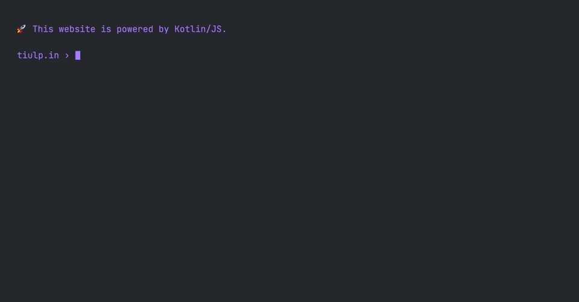

# kotlin-cv.js

[](https://tiulp.in)
[](https://github.com/tiulpin/kotlin-cv.js/actions/workflows/build.yml)

Personal terminal-like simple webpage template built with [Kotlin/JS](https://kotlinlang.org/docs/js-overview.html).



The template features CLI commands `help`, `cat`, `ls`, their completion and execution, and it's easy to implement your commands. The original idea of the CLI-like webpage is borrowed from the cool [zenith.tech](zenith.tech) website.

## Build and run

The built website contains three files:
- [`styles.css`](src/main/resources/styles.css) – fancy styles for the website
- [`index.html`](src/main/resources/index.html) – boilerplate HTML doc that contains call to `kotlin-cv.js`
- `kotlin-cv.js` – the "CLI" core, built with Kotlin/JS.

To set up a website like this, follow these steps:

- Use the template
- To run the project locally, use `./gradlew run`, to build – `./gradlew build`: the built website will be located at `./build/distributions`.
- Deploy it anywhere you want, the website [can be easily deployed to GitHub Pages](https://dev.to/kotlin/hosting-kotlin-js-on-github-pages-via-github-actions-3gep). I build it with Actions and use [Cloudflare Pages](https://pages.cloudflare.com) for [tiulp.in](https://tiulp.in/)


### F.A.Q.

#### How to change the prompt

Edit [the code](src/main/kotlin/Main.kt) that generates HTML with kotlinx:

```kotlin
div("prompt") { 
    pre {
        +"@kotlin › " 
    }
}
```

#### How to add a new command

Implement an object from the Command interface and add it to [the commands list](src/main/kotlin/Commands.kt). For example, a command to open some link (in this particular example is URL to CV) could be implemented this way:
```kotlin
"cv" to object : Command {
    override val help = "open my cv"
    override fun complete(argv: List<String>): List<String> = listOf()
    override fun exec(argv: List<String>, print: (String) -> Unit) =
        window.open("https://tiulp.in/cv.pdf", blank)!!.focus()
}
```

#### How to add "files"

Add a new "file" to [the "files" list](src/main/kotlin/Files.kt).

#### How to insert HTML from a string

Use `unsafe`:

```kotlin
p {
    unsafe {
        +"</br>"
    }
}
```
