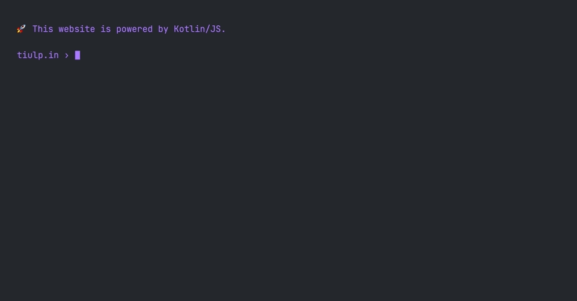

# kotlin-cv.js

[](https://github.com/tiulpin/kotlin-cv.js/actions/workflows/ci.yml)
[](https://github.com/tiulpin/kotlin-cv.js/actions/workflows/quality.yml)

Personal terminal-like simple webpage template built with [Kotlin/JS](https://kotlinlang.org/docs/js-overview.html).



The template features CLI commands like `help`, `cat`, `ls`, `grep`, `wc`, and many more utilities. Commands support completion and piping. It's easy to implement your own commands.

## Quick Start

```bash
# Install just (https://github.com/casey/just) for convenience
# Or use the gradle commands directly

# Development server with hot reload
just dev

# Build for production
just build

# Run all tests
just test

# Run unit tests only
just test-unit

# Run e2e tests (requires npm)
just test-e2e
```

## Build and Run

The built website contains three files:
- [`styles.css`](src/jsMain/resources/styles.css) – terminal styles
- [`index.html`](src/jsMain/resources/index.html) – HTML entry point
- `kotlin-cv.js` – the "CLI" core, built with Kotlin/JS

### Commands

```bash
# Run dev server
./gradlew jsBrowserDevelopmentRun --continuous

# Build production bundle
./gradlew jsBrowserProductionWebpack

# Run unit tests
./gradlew jsTest
```

The built website will be located at `./build/kotlin-webpack/js/productionExecutable/`.

### Deployment

Deploy anywhere you want. The website [can be easily deployed to GitHub Pages](https://dev.to/kotlin/hosting-kotlin-js-on-github-pages-via-github-actions-3gep). The CI workflow automatically deploys to `gh-pages` branch on push to main.

## Customization

### How to change the prompt

Edit the `host` constant in [`Main.kt`](src/jsMain/kotlin/Main.kt):

```kotlin
const val host = "your-domain.com"
```

### How to add a new command

1. Create a command object implementing the `Command` interface
2. Add it to the registry in [`Registry.kt`](src/jsMain/kotlin/commands/Registry.kt)

Example command:

```kotlin
object MyCommand : Command {
    override val help = "description of my command"
    
    override fun exec(argv: List<String>, print: (String) -> Unit) {
        print("Hello from my command!")
    }
    
    override fun complete(argv: List<String>): List<String> {
        // Return completion suggestions
        return emptyList()
    }
}

// In Registry.kt, add:
"mycommand" to MyCommand,
```

### How to add "files"

Add a new `File` to the list in [`Files.kt`](src/jsMain/kotlin/Files.kt):

```kotlin
val myFile = File(
    "readme.txt", 
    "This is the content of my file.$br$br Use HTML for formatting."
)

val files = listOf(hey, quoteTxt, myFile)
```

### Available Commands

| Command                 | Description                                         |
|-------------------------|-----------------------------------------------------|
| `help`                  | Show all commands                                   |
| `cat`                   | Display file contents                               |
| `ls`                    | List files (with flags: -l, -a, -h, -r, -t, -S, -1) |
| `tree`                  | Show file tree                                      |
| `grep`                  | Search for patterns                                 |
| `wc`                    | Word/line/char count                                |
| `head`/`tail`           | Show first/last lines                               |
| `echo`                  | Print text                                          |
| `clear`                 | Clear terminal                                      |
| `history`               | Show command history                                |
| `date`                  | Current date/time                                   |
| `whoami`                | Current user                                        |
| `pwd`                   | Current directory                                   |
| `printenv`              | Environment variables                               |
| `uptime`                | Session uptime                                      |
| `neofetch`              | System info                                         |
| `open`                  | Open URL                                            |
| `uuid`                  | Generate UUID                                       |
| `base64`                | Encode/decode base64                                |
| `json`                  | Pretty-print JSON                                   |
| `urlencode`/`urldecode` | URL encoding                                        |
| `color`                 | Preview color                                       |
| `man`                   | Manual for command                                  |

### Piping

Commands support piping:

```bash
cat file.txt | grep pattern | wc -l
echo hello world | wc -w
```

## Project Structure

```
src/
├── jsMain/
│   ├── kotlin/
│   │   ├── commands/     # Command implementations
│   │   │   ├── Command.kt
│   │   │   ├── Console.kt
│   │   │   ├── Registry.kt
│   │   │   └── ...
│   │   ├── Main.kt       # Entry point
│   │   ├── Files.kt      # Virtual filesystem
│   │   └── Environment.kt
│   └── resources/
│       ├── index.html
│       └── styles.css
└── jsTest/
    └── kotlin/
        └── commands/     # Unit tests
e2e/
├── tests/                # Playwright e2e tests
├── playwright.config.ts
└── package.json
```
